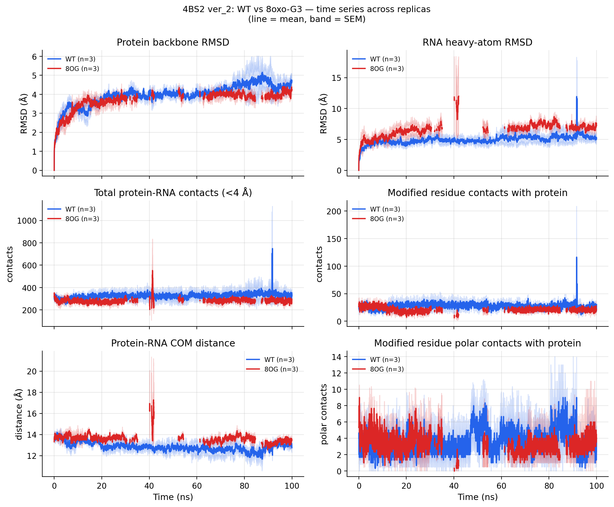
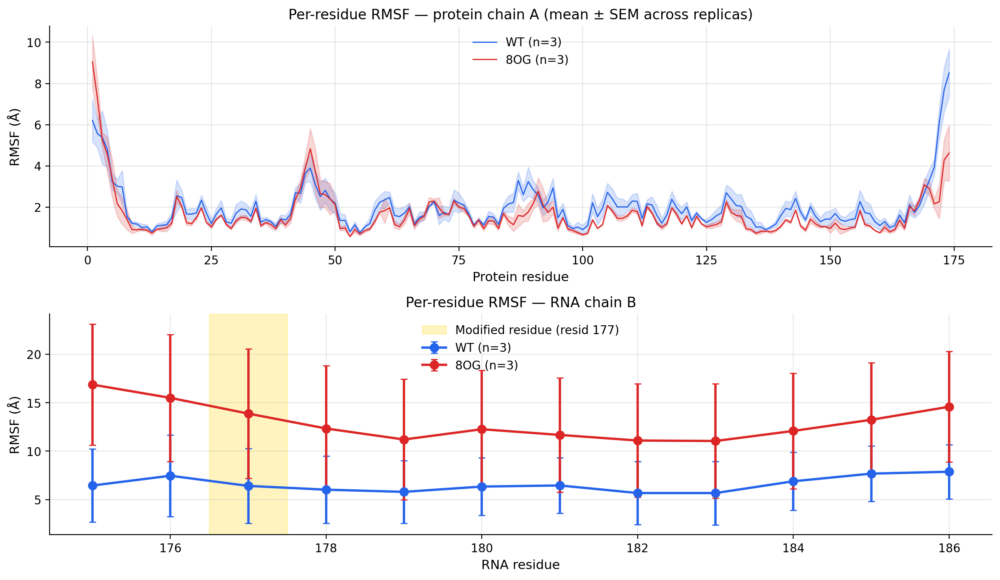
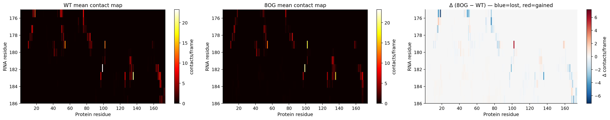
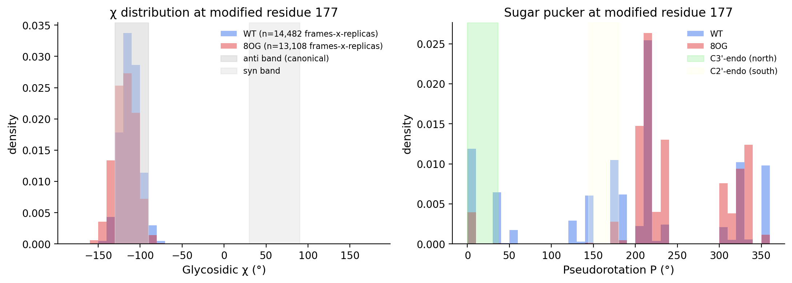

# ver_2 4BS2 / WT vs 8oxo-G3 — comparative MD analysis

## Replicas analysed
### WT
- `r1`  frames 5000 / t_max 100 ns
- `r2`  frames 5000 / t_max 100 ns
- `r3`  frames 5000 / t_max 100 ns

### 8OG
- `r1`  frames 5000 / t_max 100 ns
- `r2`  frames 5000 / t_max 100 ns
- `r3`  frames 5000 / t_max 100 ns

## Time-series scalar metrics (means across all frames+replicas)

| Metric | WT mean | 8OG mean | Δ |
|------|------:|------:|------:|
| `prot_rmsd` | 3.947 | 3.676 | -0.271 |
| `rna_rmsd` | 4.904 | 6.319 | +1.415 |
| `n_contacts` | 325.725 | 280.953 | -44.772 |
| `com_dist` | 12.853 | 13.565 | +0.713 |
| `g3_contacts` | 27.251 | 20.074 | -7.177 |
| `g3_hbonds` | 3.554 | 2.730 | -0.824 |
| `chi_at_resid_177` | -111.461 | -117.501 | -6.040 |
| `pucker_at_resid_177` | 190.208 | 243.578 | +53.371 |

## Statistical tests (WT vs 8OG)

| Metric | n_WT | n_8OG | Welch t (p) | KS (p) | MW U (p) |
|------|------:|------:|------:|------:|------:|
| `prot_rmsd` | 15000 | 15000 | 35.17 (4.86e-265) | 0.173 (5.69e-180) | 118550494 (2.63e-280) |
| `rna_rmsd` | 15000 | 15000 | -79.25 (0.00e+00) | 0.451 (0.00e+00) | 42867302 (0.00e+00) |
| `n_contacts` | 15000 | 15000 | 73.11 (0.00e+00) | 0.322 (0.00e+00) | 136719112 (0.00e+00) |
| `com_dist` | 15000 | 15000 | -85.45 (0.00e+00) | 0.476 (0.00e+00) | 43359365 (0.00e+00) |
| `g3_contacts` | 15000 | 15000 | 71.27 (0.00e+00) | 0.331 (0.00e+00) | 137277909 (0.00e+00) |
| `g3_hbonds` | 15000 | 15000 | 25.62 (4.82e-143) | 0.140 (9.37e-118) | 111099015 (4.50e-137) |
| `chi_at_resid_177` | 15000 | 15000 | 40.50 (0.00e+00) | 0.204 (1.81e-252) | 119994928 (0.00e+00) |
| `pucker_at_resid_177` | 15000 | 15000 | -48.42 (0.00e+00) | 0.388 (0.00e+00) | 64887501 (0.00e+00) |

## Figures

## Methodology notes

- **Force field**: Amber14 ff14SB (protein) + RNA.OL3 + TIP3P + modxna (Bergonzo 2024) for 8OG residue. modxna's strip+charge bug patched + post-build charge rebalancing applied (see `pipeline/rebalance_lib.py`). Net residue charge of internal 8OG = -1.000000 e exactly.
- **MD protocol**: minimize 1000 → NVT 100 ps → NPT 100 ps → Production 100 ns @ 4 fs HMR Langevin (300 K, 1/ps). PME 1.2 nm cutoff, HBonds constraints. n=3 replicas per system, independent seeds.
- **Alignment**: protein C-alpha to frame 0 in memory before RNA RMSD (so RMSD captures motion *relative to protein*).
- **PBC**: minimum-image for RNA RMSD, COM distance, and per-residue position storage.
- **Statistical tests**: Welch's t-test (mean), Kolmogorov-Smirnov (distribution), Mann-Whitney U (rank). With n=3 replicas pooled across frames, p-values are over the empirical distribution of frames; treat as descriptive, not formal hypothesis tests, given correlated samples.
